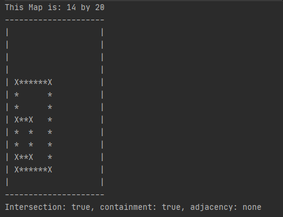

<div align="center" id="top"> 


 
</div>

<h1 align="center">Rectangle Alignment Mapper</h1>

<p align="center">
  

  

</p>


<p align="center">
  <a href="#dart-about">About</a> &#xa0; | &#xa0; 
  <a href="#sparkles-features">Features</a> &#xa0; | &#xa0;
  <a href="#rocket-technologies">Technologies</a> &#xa0; | &#xa0;
  <a href="#white_check_mark-requirements">Requirements</a> &#xa0; | &#xa0;
  <a href="#checkered_flag-starting">Starting</a> &#xa0; | &#xa0;
  <a href="https://github.com/{{YOUR_GITHUB_USERNAME}}" target="_blank">Author</a>
</p>

  

  &#xa0;

<br>

## :dart: About ##

This mini project allows the user to create a map and two rectangles to be placed on a grid.
Once the rectangles are added the map can be drawn. In addition to drawing out the rectangles,
 it will also describe the relationship between them.

## :sparkles: Features ##

:heavy_check_mark: Create your own map.
:heavy_check_mark: Create unique rectangles to be added by size and location.
:heavy_check_mark: Checks if the rectangles intersect at any point.
:heavy_check_mark: Checks if either of the rectangles is contained within the other.
:heavy_check_mark: Checks if the rectangles are adjacent and declares if Proper, Sub-line or Partial.

## :rocket: Technologies ##

The following tools were used in this project:

- [Java 11](https://docs.oracle.com/en/java/javase/index.html)
- [JUnit Testing](https://junit.org/junit5/)

## :white_check_mark: Requirements ##

Before starting :checkered_flag:, you need to have [Git](https://git-scm.com), [JDK 11](https://adoptopenjdk.net/) installed and a Java IDE such as: [IntelliJ IDEA](https://www.jetbrains.com/idea/).

## :checkered_flag: Starting ##

```bash
# Clone this project
$ git clone https://github.com/Mark-The-Dev/Rectangle-Alignment-Mapper.git

# Access
$ cd https://github.com/Mark-The-Dev/Rectangle-Alignment-Mapper

# Run the project
$ Open project folder with IDE and run at main.

```


Made with :heart: by <a href="https://github.com/Mark-The-Dev" target="_blank">Mark Marcello</a>

&#xa0;

<a href="#top">Back to top</a>